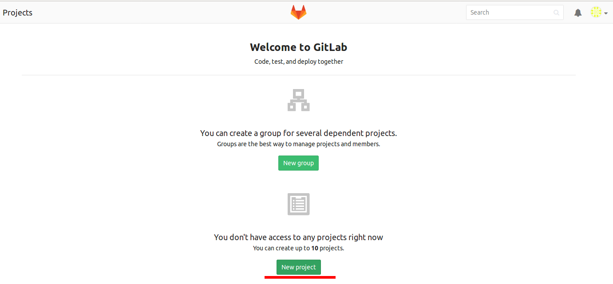
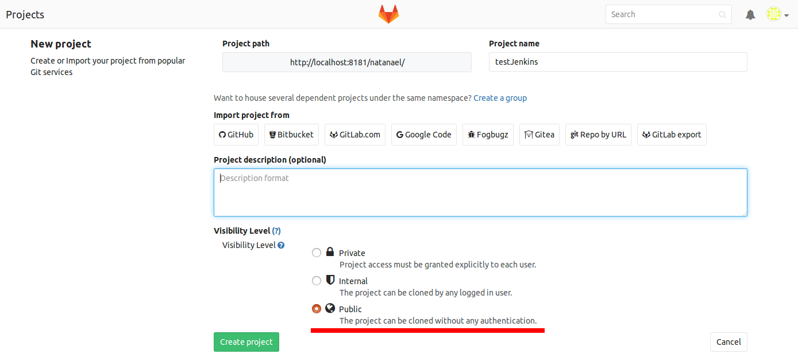

Após fazer a configuração inicial do GitLab, crie um novo projeto público:

Clone o projeto criado para sua máquina:

cd

git clone http://[[suamaquina]]:8181/[[seuusuário]]/testJenkins.git ./testJenkins

cd testJenkins
