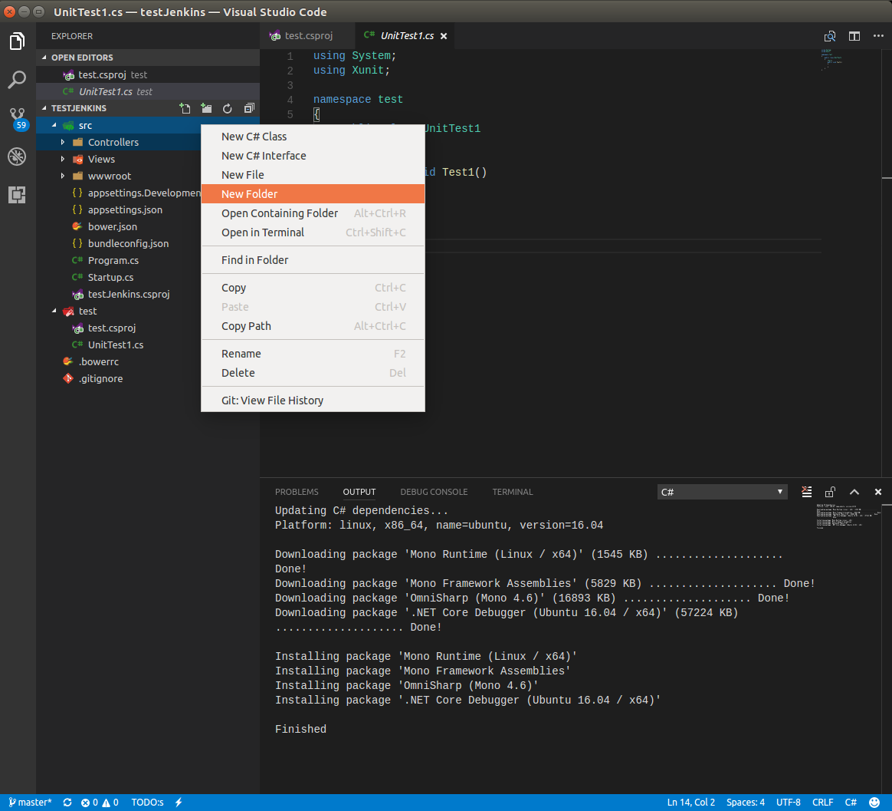
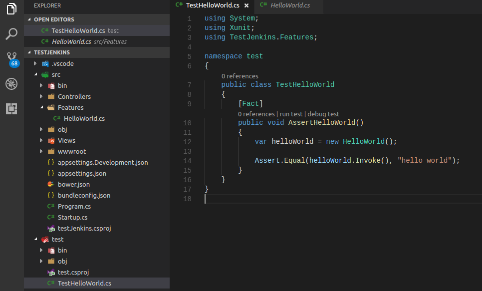
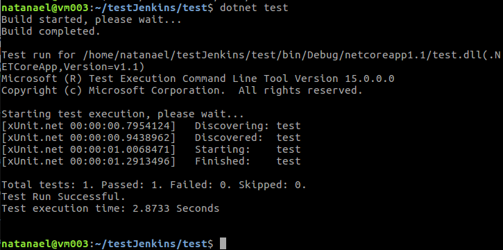

*Estando na pasta do projeto, crie um novo projeto .net:
dotnet new mvc

*Mova o projeto para uma pasta chamada src:
mkdir src
mv !(src) src

*Crie um novo projeto de teste:
mkdir test
cd test
dotnet new xunit

*Abra a pasta em que foram criados os projetos com o editor de sua preferência:
cd ..
code .

#

*Adicione uma pasta chamada Features dentro da pasta src:

*Dentro dessa pasta, adicione uma classe chamada HelloWorld.cs

*Na classe HelloWorld, vamos adicionar um método que retorne, simplesmente, o texto "hello world":

#

*Edite o seguinte arquivo:
./test/test.csproj

E adicione a seguinte tag:

	<ItemGroup>
		<ProjectReference Include="..\src\testJenkins.csproj" />
	  </ItemGroup>
	  
*Ainda no projeto de teste, renomeie a classe UnitTest1.cs para TestHelloWorld.cs
*E, dentro dela, crie um método chamado AssertHelloWorld() que deverá ser decorado com [Fact]. Esse método irá validar se o resultado de HelloWorld será a string "hello world":

*Feito isso, vamos rodar esse teste:
cd ~/testJenkins/test
dotnet restore
dotnet test

*Nesse momento, o teste deve ter passado.

*Feito isso, vamos subir as mudanças para o GitLab:

cd ~/testJenkins
git add --all
git commit -m "Criação do projeto"
git push