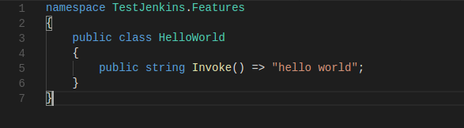
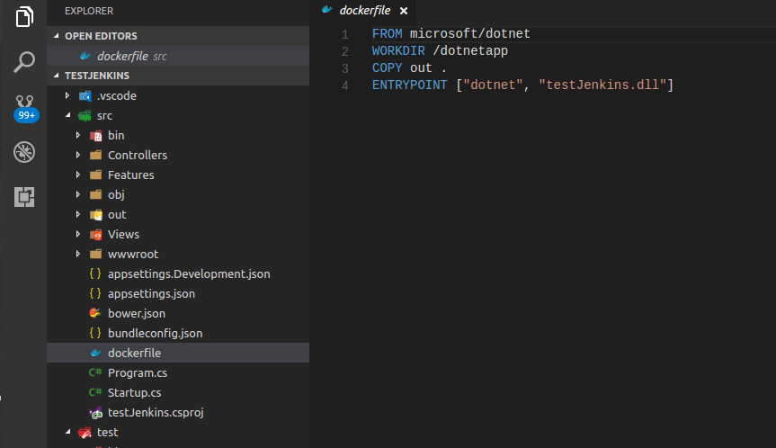
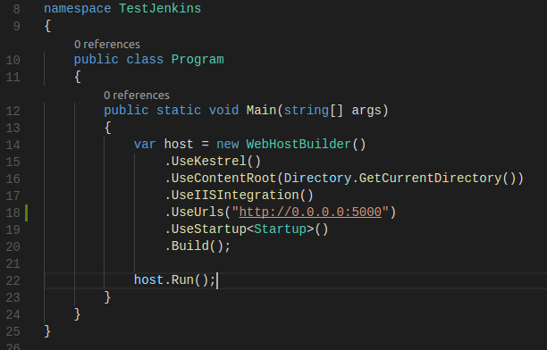

*Estando na pasta do projeto, crie um novo projeto .net:
``` shell
dotnet new mvc
```

*Mova o projeto para uma pasta chamada src:
``` shell
mkdir src
mv !(src) src
```

*Crie um novo projeto de teste:
``` shell
mkdir test
cd test
dotnet new xunit
```

*Abra a pasta em que foram criados os projetos com o editor de sua preferência:
``` shell
cd ..
code .
```

#

*Adicione uma pasta chamada Features dentro da pasta src:


*Dentro dessa pasta, adicione uma classe chamada HelloWorld.cs


*Na classe HelloWorld, vamos adicionar um método que retorne, simplesmente, o texto "hello world":


#

*Edite o seguinte arquivo:
``` shell
./test/test.csproj
```

E adicione a seguinte tag:
```xml
	<ItemGroup>
		<ProjectReference Include="..\src\testJenkins.csproj" />
	  </ItemGroup>
```

*Ainda no projeto de teste, renomeie a classe UnitTest1.cs para TestHelloWorld.cs

*E, dentro dela, crie um método chamado AssertHelloWorld() que deverá ser decorado com [Fact]. Esse método irá validar se o resultado de HelloWorld será a string "hello world":


*Feito isso, vamos rodar esse teste:
``` shell
cd ~/testJenkins/test
dotnet restore
dotnet test
```


*Nesse momento, o teste deve ter passado.


*Novamente em src, crie um arquivo chamado dockerfile e nele, escreva os seguintes comandos:
```docker
FROM microsoft/dotnet
WORKDIR /dotnetapp
COPY out .
ENTRYPOINT ["dotnet", "testJenkins.dll"]
```



*No Program.cs, adicione a seguinte linha no WebHostBuilder:

```.net
.UseUrls("http://0.0.0.0:5000")
```



*Feito isso, vamos subir as mudanças para o GitLab:
``` shell
cd ~/testJenkins
git add --all
git commit -m "Criação do projeto"
git push
```
