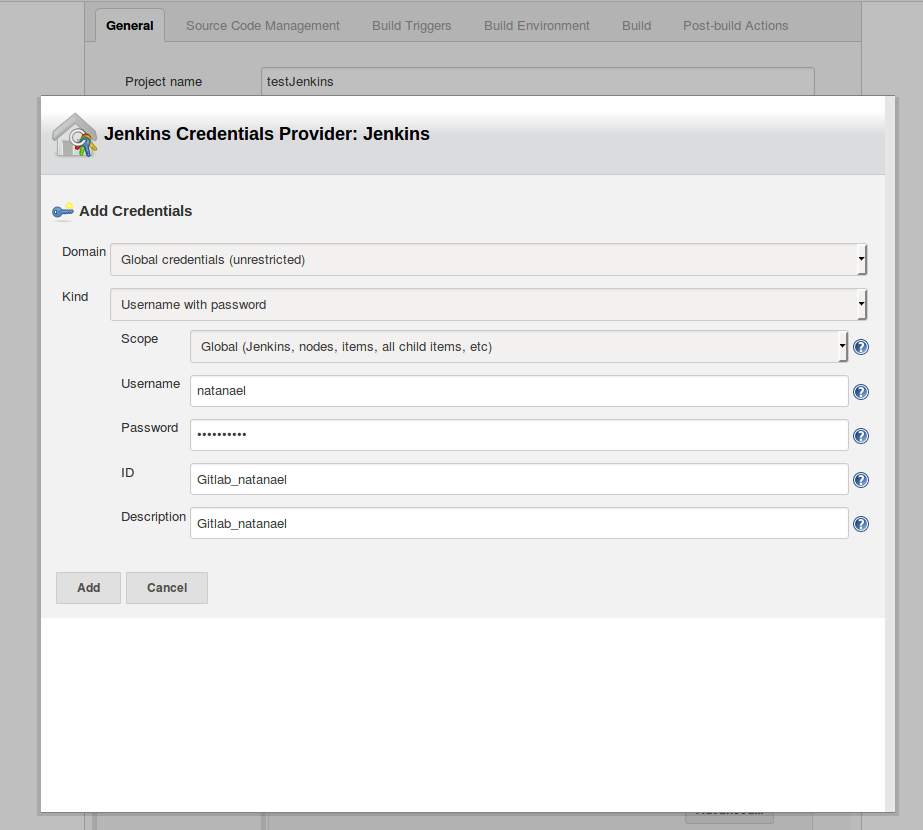

Na página inicial do Jenkins, clique em "Manage Jenkins":


Feito isso, clique em "Manage Plugins":


Vá à aba "Available" e Filtre por GitLab.
Instale "GitLab Plugin" e "GitLab Hook Plugin":


Feito isso, será necessário gerar um Access Token no GitLab:


Copie o token gerado:


De volta ao Jenkins, vamos adicionar uma credencial de acesso.

Na tela inicial, clique em Credentials e depois em Add Credentials:


Na próxima tela, selecione "GitLab API Token" e cole o token gerado:


Agora, com a credencial criada, clique em "Manage Jenkins" e "Configure System":


Em GitLab, configure as conexões:


Tudo configurado!

Agora volte para a página inicial do Jenkins e crie um novo projeto freestyle:


Nas configurações do projeto, selecione a GitLab Connection que você acabou de criar.

Em Source Code Management, marque "Git", adicione o endereço do seu repositório e crie uma nova Credential de acesso:


Ao clicar em "Add" na opção de credentials, insira um username e password válidos para o Gitlab:


Feito isso, vamos configurar os "Build Triggers":


Adicione um "Build Step" em "Build" e selecione "Execute Shell". Dentro de "Command", cole os comandos abaixo:
```shell
cd test
dotnet restore
dotnet test

cd ../src
dotnet restore
dotnet publish -c Release -o out

app="dotnetapp"
docker build -t $app .
if docker ps | awk -v app="$app" 'NR > 1 && $NF == app{ret=1; exit} END{exit !ret}'; then
  docker stop "$app"
fi

docker build -t dotnetapp .
docker run --rm -d -p 5000:5000 --name $app $app
```
Mas antes, se você ainda não deu permissões para seu usuário rodar comandos do docker, você terá que executar os comandos abaixo:
```shell
sudo usermod -aG docker $(whoami)
sudo chmod 777 /var/run/docker.sock 
```

Em "Post-build Actions", selecione "Publish build status to GitLab commit"


Depois disso, salve o projeto.

Por fim, vamos configurar o Webhook no GitLab.

Na página do projeto no GitLab, clique na engrenagem no canto superior direito e depois em "Integrations":


Cole a Url que o Jenkins forneceu, substitua "localhost" por "jenkins" e clique em "Add Webhook".


