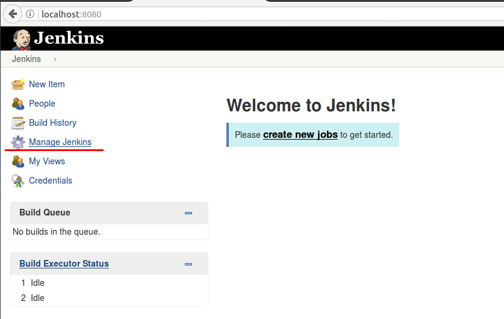
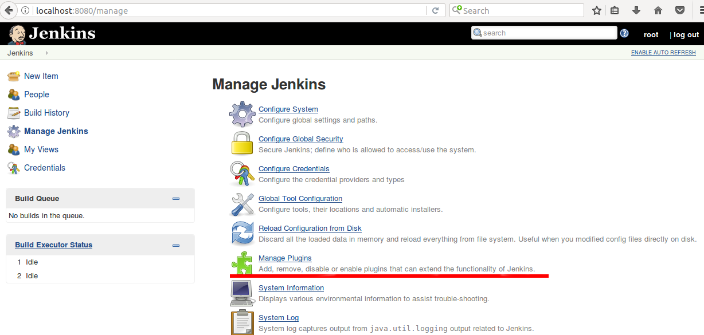
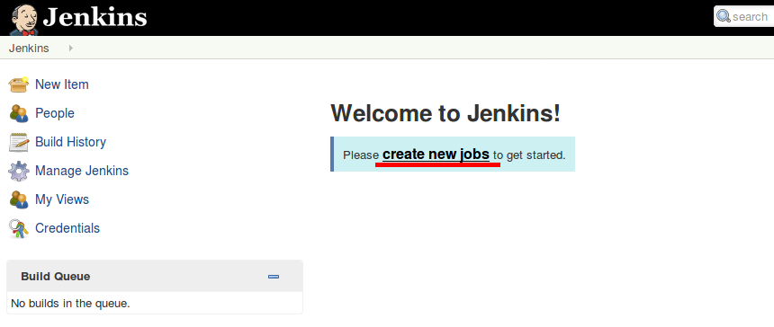
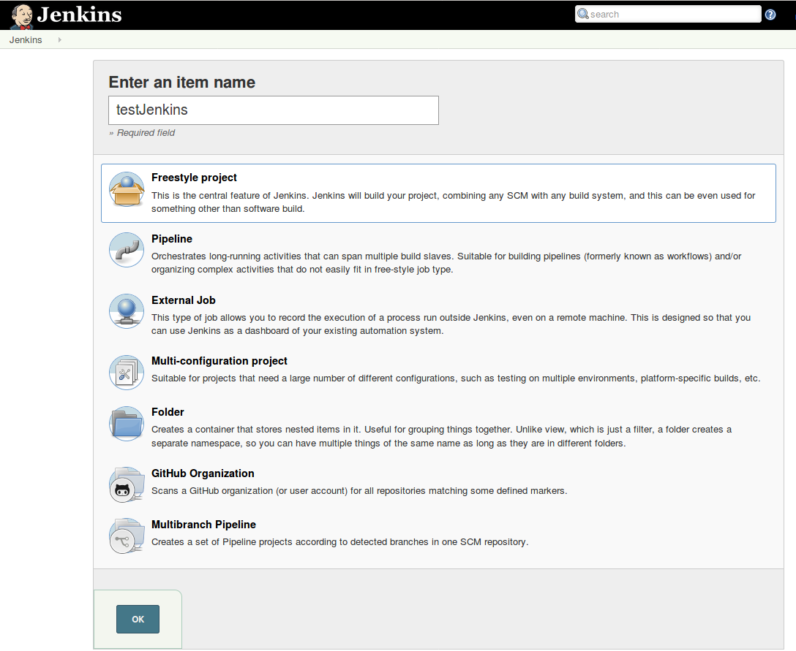

Na página inicial do Jenkins, clique em "Manage Jenkins":

Feito isso, clique em "Manage Plugins":

Vá à aba "Available" e Filtre por GitLab.
Instale "GitLab Plugin" e "GitLab Hook Plugin":

Feito isso, volte para a página inicial do Jenkins e crie um novo projeto freestyle:

